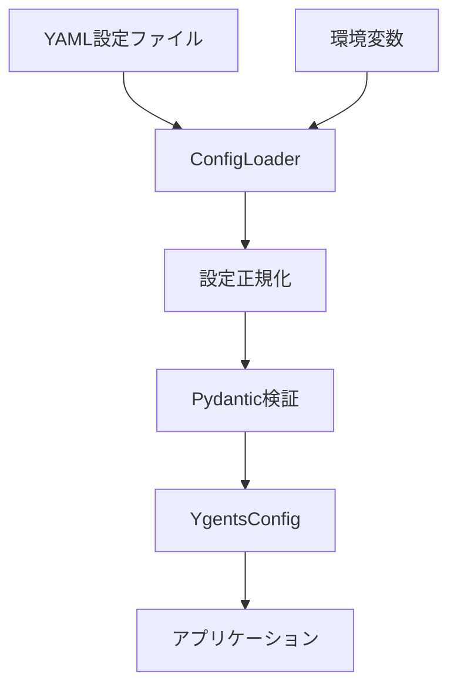

# 設定管理モジュール設計ドキュメント

## 概要

ygentsプロジェクトの設定管理モジュールは、YAML設定ファイルと環境変数による設定を統合し、型安全かつ検証可能な設定システムを提供します。テスト駆動開発（TDD）により実装され、高品質なコードベースを実現しています。

## アーキテクチャ

### モジュール構成

```
src/ygents/config/
├── __init__.py         # パブリックAPI
├── models.py          # Pydantic設定データモデル
└── loader.py          # 設定ローダー
```

### データフロー



## 設定データモデル

### 階層構造

```python
YgentsConfig
├── mcp_servers: Dict[str, Dict[str, Any]]  # FastMCP形式の生辞書
└── llm: LLMConfig
    ├── provider: Literal["openai", "claude"]
    ├── openai: Optional[OpenAIConfig]
    └── claude: Optional[ClaudeConfig]
```

### MCPサーバー設定（生辞書形式）

MCP（Model Context Protocol）サーバーの設定を、FastMCPライブラリが期待する形式の生辞書で管理します。バリデーションはFastMCPライブラリに委譲することで、設定形式の互換性を保ちつつ実装を簡素化します。

```python
# MCPサーバー設定の型定義（型ヒント用）
MCPServerConfig = Dict[str, Any]
```

**FastMCP対応形式:**
- **HTTPサーバー**: `{"url": "https://..."}`
- **ローカルプロセス**: `{"command": "python", "args": ["script.py"]}`
- **その他**: FastMCPが対応する任意の形式

**使用例:**
```yaml
mcpServers:
  weather:
    url: "https://weather-api.example.com/mcp"
  local_assistant:
    command: "python"
    args: ["./assistant_server.py", "--port", "8080"]
  advanced_server:
    command: "node"
    args: ["server.js"]
    env:
      DEBUG: "true"
```

**バリデーション方針:**
- 設定の構文チェックのみYAML読み込み時に実施
- 意味的バリデーション（url/command必須など）はFastMCPに委譲
- エラーはFastMCP接続時に表面化、詳細なエラーメッセージを提供

### LLM設定

#### LLMConfig

LLMプロバイダーの統合設定を管理します。

```python
class LLMConfig(BaseModel):
    provider: Literal["openai", "claude"]
    openai: Optional[OpenAIConfig] = None
    claude: Optional[ClaudeConfig] = None
```

**バリデーションルール:**
- 指定されたプロバイダーに対応する設定が必須

#### OpenAIConfig

```python
class OpenAIConfig(BaseModel):
    api_key: str
    model: str = "gpt-3.5-turbo"  # デフォルト値
```

#### ClaudeConfig

```python
class ClaudeConfig(BaseModel):
    api_key: str
    model: str = "claude-3-sonnet-20240229"  # デフォルト値
```

## 設定ローダー

### ConfigLoader

設定の読み込み、正規化、検証を担当するクラスです。

```python
class ConfigLoader:
    def load_from_file(self, config_path: str) -> YgentsConfig
    def load_from_dict(self, config_dict: Dict[str, Any]) -> YgentsConfig
```

### 処理フロー

1. **YAML読み込み** (`load_from_file`)
   - YAMLファイルの存在確認
   - YAML構文解析
   - エラーハンドリング

2. **設定正規化** (`_normalize_dict_keys`)
   - camelCase → snake_case変換
   - `mcpServers` → `mcp_servers`

3. **環境変数適用** (`_apply_env_overrides`)
   - `OPENAI_API_KEY` → `llm.openai.api_key`
   - `ANTHROPIC_API_KEY` → `llm.claude.api_key`

4. **Pydantic検証**
   - 型チェック
   - 必須フィールド検証
   - カスタムバリデーション実行

### エラーハンドリング

```python
# ファイル不存在
raise FileNotFoundError(f"Configuration file not found: {config_path}")

# YAML構文エラー
raise ValueError(f"Invalid YAML syntax: {e}")

# 設定検証エラー
raise ValueError(f"Configuration validation error: {e}")
```

## 設定ファイル形式

### 基本形式

```yaml
# MCP サーバー設定
mcpServers:
  weather:
    url: "https://weather-api.example.com/mcp"
  assistant:
    command: "python"
    args: ["./assistant_server.py"]

# LLM プロバイダー設定
llm:
  provider: "openai"  # または "claude"
  openai:
    api_key: "your-openai-api-key"
    model: "gpt-3.5-turbo"  # オプショナル
  claude:
    api_key: "your-claude-api-key"
    model: "claude-3-sonnet-20240229"  # オプショナル
```

### 環境変数による上書き

環境変数が設定されている場合、YAML設定を上書きします：

```bash
export OPENAI_API_KEY="env-override-key"
export ANTHROPIC_API_KEY="env-override-key"
```

### デフォルト値

- OpenAI model: `"gpt-3.5-turbo"`
- Claude model: `"claude-3-sonnet-20240229"`

## テスト設計

### テスト構成

```
tests/test_config/
├── __init__.py
├── test_models.py    # データモデルテスト（12テストケース）
└── test_loader.py    # ローダーテスト（8テストケース）
```

### テスト範囲

**合計20テストケース、95%カバレッジ**

#### モデルテスト (test_models.py)
- OpenAIConfig/ClaudeConfig: 必須フィールド、デフォルト値
- LLMConfig: プロバイダー検証、設定整合性
- YgentsConfig: 全体設定の統合（MCP設定は生辞書として扱う）

#### ローダーテスト (test_loader.py)
- YAML読み込み: 基本形式、各プロバイダー
- 環境変数上書き: API key上書き動作
- エラーハンドリング: ファイル不存在、YAML構文エラー
- デフォルト値適用
- 辞書形式読み込み

**簡素化された点:**
- MCPServerConfigのバリデーションテストを削除（FastMCPに委譲）
- 設定検証エラーテストを削除（FastMCP接続時にチェック）
- テストケース数を26→20に削減

### テストFixture

環境変数のテストを効率化するための共通Fixture：

```python
@pytest.fixture
def clean_env():
    """環境変数を一時的にクリアし、テスト後に復元"""

@pytest.fixture  
def env_with_keys():
    """テスト用API keyを設定し、テスト後に復元"""
```

## 実装の特徴

### 型安全性

- **Pydantic v2**: 実行時型チェックとデータ検証
- **mypy**: 静的型チェック（types-PyYAML対応）
- **Literal型**: プロバイダー選択の型安全性

### 堅牢性

- **包括的バリデーション**: 設定の整合性を保証
- **詳細なエラーメッセージ**: デバッグを容易にする
- **フォールバック**: デフォルト値による安全な動作

### 拡張性

- **プロバイダー追加**: 新しいLLMプロバイダーの容易な追加
- **設定項目追加**: Pydanticモデルの拡張による新機能対応
- **カスタムバリデーション**: `@model_validator`による柔軟な検証

### テスト品質

- **TDD**: 実装前のテスト作成による品質保証
- **高カバレッジ**: 95%のテストカバレッジ
- **環境分離**: Fixtureによる独立したテスト実行

## 今後の拡張予定

1. **追加プロバイダー**
   - Google Gemini
   - Ollama (ローカルLLM)

2. **設定機能拡張**
   - 設定プロファイル管理
   - 動的設定リロード

3. **セキュリティ強化**
   - API key暗号化
   - 設定ファイル権限チェック

## 関連ファイル

- `src/ygents/config/models.py`: データモデル定義
- `src/ygents/config/loader.py`: 設定ローダー実装
- `tests/test_config/`: テストスイート
- `pyproject.toml`: 依存関係定義
- `REQUIREMENTS.md`: 設定形式仕様