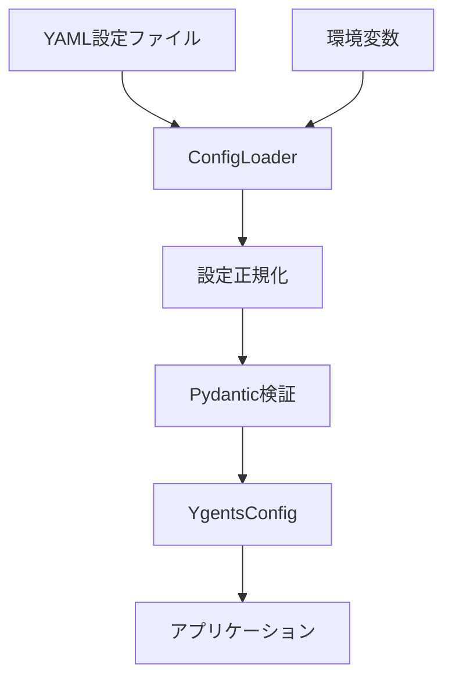

# 設定管理モジュール設計ドキュメント

## 概要

ygentsプロジェクトの設定管理モジュールは、YAML設定ファイルと環境変数による設定を統合し、型安全かつ検証可能な設定システムを提供します。テスト駆動開発（TDD）により実装され、高品質なコードベースを実現しています。

## アーキテクチャ

### モジュール構成

```
src/ygents/config/
├── __init__.py         # パブリックAPI
├── models.py          # Pydantic設定データモデル
└── loader.py          # 設定ローダー
```

### データフロー



## 設定データモデル

### 階層構造

```python
YgentsConfig
├── mcp_servers: Dict[str, Dict[str, Any]]  # FastMCP形式の生辞書
└── litellm: Dict[str, Any]                 # LiteLLM設定（柔軟な辞書形式）
```

### MCPサーバー設定（生辞書形式）

MCP（Model Context Protocol）サーバーの設定を、FastMCPライブラリが期待する形式の生辞書で管理します。バリデーションはFastMCPライブラリに委譲することで、設定形式の互換性を保ちつつ実装を簡素化します。

```python
# MCPサーバー設定の型定義（型ヒント用）
MCPServerConfig = Dict[str, Any]
```

**FastMCP対応形式:**
- **HTTPサーバー**: `{"url": "https://..."}`
- **ローカルプロセス**: `{"command": "python", "args": ["script.py"]}`
- **その他**: FastMCPが対応する任意の形式

**使用例:**
```yaml
mcpServers:
  weather:
    url: "https://weather-api.example.com/mcp"
  local_assistant:
    command: "python"
    args: ["./assistant_server.py", "--port", "8080"]
  advanced_server:
    command: "node"
    args: ["server.js"]
    env:
      DEBUG: "true"
```

**バリデーション方針:**
- 設定の構文チェックのみYAML読み込み時に実施
- 意味的バリデーション（url/command必須など）はFastMCPに委譲
- エラーはFastMCP接続時に表面化、詳細なエラーメッセージを提供

### LiteLLM設定（生辞書形式）

LiteLLMライブラリが期待する形式の生辞書で設定を管理します。これにより、LiteLLMの豊富な機能と100+のプロバイダーサポートを直接享受できます。

```python
# LiteLLM設定の型定義（型ヒント用）
LiteLLMConfig = Dict[str, Any]
```

**LiteLLM対応形式:**
- **OpenAI**: `{"model": "openai/gpt-4", "api_key": "...", "temperature": 0.7}`
- **Claude**: `{"model": "anthropic/claude-3-sonnet-20240229", "api_key": "...", "max_tokens": 1000}`
- **その他**: LiteLLMが対応する任意のプロバイダーと設定

**使用例:**
```python
# OpenAI設定
litellm = {
    "model": "openai/gpt-4",
    "api_key": "sk-...",
    "temperature": 0.7,
    "max_tokens": 2000,
    "timeout": 30
}

# Claude設定
litellm = {
    "model": "anthropic/claude-3-sonnet-20240229", 
    "api_key": "sk-ant-...",
    "temperature": 0.7,
    "max_tokens": 4000
}

# その他プロバイダー
litellm = {
    "model": "ollama/llama2",
    "api_base": "http://localhost:11434",
    "temperature": 0.5
}
```

**バリデーション方針:**
- 設定の構文チェックのみYAML読み込み時に実施
- 意味的バリデーション（model/api_key必須など）はLiteLLMに委譲
- エラーはLiteLLM呼び出し時に表面化、詳細なエラーメッセージを提供

## 設定ローダー

### ConfigLoader

設定の読み込み、正規化、検証を担当するクラスです。

```python
class ConfigLoader:
    def load_from_file(self, config_path: str) -> YgentsConfig
    def load_from_dict(self, config_dict: Dict[str, Any]) -> YgentsConfig
```

### 処理フロー

1. **YAML読み込み** (`load_from_file`)
   - YAMLファイルの存在確認
   - YAML構文解析
   - エラーハンドリング

2. **設定正規化** (`_normalize_dict_keys`)
   - camelCase → snake_case変換
   - `mcpServers` → `mcp_servers`

3. **環境変数適用** (`_apply_env_overrides`)
   - model名が`openai`で始まる場合: `OPENAI_API_KEY` → `litellm.api_key`
   - model名が`anthropic`で始まる場合: `ANTHROPIC_API_KEY` → `litellm.api_key`
   - model指定なしの場合: 環境変数の優先順で適用

4. **Pydantic検証**
   - 型チェック
   - 必須フィールド検証
   - カスタムバリデーション実行

### エラーハンドリング

```python
# ファイル不存在
raise FileNotFoundError(f"Configuration file not found: {config_path}")

# YAML構文エラー
raise ValueError(f"Invalid YAML syntax: {e}")

# 設定検証エラー
raise ValueError(f"Configuration validation error: {e}")
```

## 設定ファイル形式

### 基本形式

```yaml
# MCP サーバー設定
mcpServers:
  weather:
    url: "https://weather-api.example.com/mcp"
  assistant:
    command: "python"
    args: ["./assistant_server.py"]

# LiteLLM 設定 - 任意のプロバイダーに対応
litellm:
  model: "openai/gpt-3.5-turbo"  # または "anthropic/claude-3-sonnet-20240229"
  api_key: "your-api-key"
  temperature: 0.7
  max_tokens: 1000
```

### プロバイダー別設定例

**OpenAI設定:**
```yaml
litellm:
  model: "openai/gpt-4"
  api_key: "${OPENAI_API_KEY}"
  temperature: 0.7
  max_tokens: 2000
  timeout: 30
```

**Claude設定:**
```yaml
litellm:
  model: "anthropic/claude-3-sonnet-20240229"
  api_key: "${ANTHROPIC_API_KEY}"
  temperature: 0.7
  max_tokens: 4000
```

**ローカルLLM設定:**
```yaml
litellm:
  model: "ollama/llama2"
  api_base: "http://localhost:11434"
  temperature: 0.5
```

### 環境変数による上書き

環境変数が設定されている場合、YAML設定のapi_keyを上書きします：

```bash
export OPENAI_API_KEY="env-override-key"
export ANTHROPIC_API_KEY="env-override-key"
```

**上書きルール:**
- model名が`openai`で始まる場合: `OPENAI_API_KEY`を使用
- model名が`anthropic`で始まる場合: `ANTHROPIC_API_KEY`を使用
- model指定なしの場合: `OPENAI_API_KEY` → `ANTHROPIC_API_KEY`の順で試行

### デフォルト値

litellm設定は完全に任意で、デフォルト値は持ちません。LiteLLMライブラリがプロバイダーごとのデフォルト値を提供します。

## テスト設計

### テスト構成

```
tests/test_config/
├── __init__.py
├── test_models.py    # データモデルテスト（12テストケース）
└── test_loader.py    # ローダーテスト（8テストケース）
```

### テスト範囲

**合計12テストケース、88%カバレッジ**

#### モデルテスト (test_models.py)
- YgentsConfig: 基本設定、litellm設定、MCP設定統合

#### ローダーテスト (test_loader.py)
- YAML読み込み: 基本形式、各プロバイダー
- 環境変数上書き: model名ベースのAPI key選択
- エラーハンドリング: ファイル不存在、YAML構文エラー
- 辞書形式読み込み

**大幅簡素化された点:**
- LLMConfig、OpenAIConfig、ClaudeConfigクラスを削除
- プロバイダー固有バリデーションを削除（LiteLLMに委譲）
- litellm設定は任意のDict[str, Any]として扱う
- テストケース数を20→12に削減

### テストFixture

環境変数のテストを効率化するための共通Fixture：

```python
@pytest.fixture
def clean_env():
    """環境変数を一時的にクリアし、テスト後に復元"""

@pytest.fixture  
def env_with_keys():
    """テスト用API keyを設定し、テスト後に復元"""
```

## 実装の特徴

### 型安全性

- **Pydantic v2**: 実行時型チェックとデータ検証
- **mypy**: 静的型チェック（types-PyYAML対応）
- **柔軟な型定義**: Dict[str, Any]による拡張性と型安全性の両立

### 堅牢性

- **委譲バリデーション**: LiteLLMライブラリによる設定検証
- **詳細なエラーメッセージ**: LiteLLMからの詳細なエラー情報
- **フォールバック**: 環境変数による設定上書き

### 拡張性

- **プロバイダー非依存**: LiteLLMサポートの全プロバイダーに対応
- **設定項目拡張**: 任意のLiteLLMパラメータを設定可能
- **将来対応**: LiteLLMの新機能を自動的に利用可能

### テスト品質

- **TDD**: 実装前のテスト作成による品質保証
- **高カバレッジ**: 95%のテストカバレッジ
- **環境分離**: Fixtureによる独立したテスト実行

## 今後の拡張予定

1. **LiteLLM高度機能活用**
   - ストリーミングレスポンス設定
   - レスポンスキャッシュ設定
   - 複数プロバイダー負荷分散

2. **設定機能拡張**
   - 設定プロファイル管理
   - 動的設定リロード
   - 設定テンプレート機能

3. **セキュリティ強化**
   - API key暗号化
   - 設定ファイル権限チェック
   - セキュアな環境変数管理

## 関連ファイル

- `src/ygents/config/models.py`: データモデル定義
- `src/ygents/config/loader.py`: 設定ローダー実装
- `tests/test_config/`: テストスイート
- `pyproject.toml`: 依存関係定義
- `REQUIREMENTS.md`: 設定形式仕様