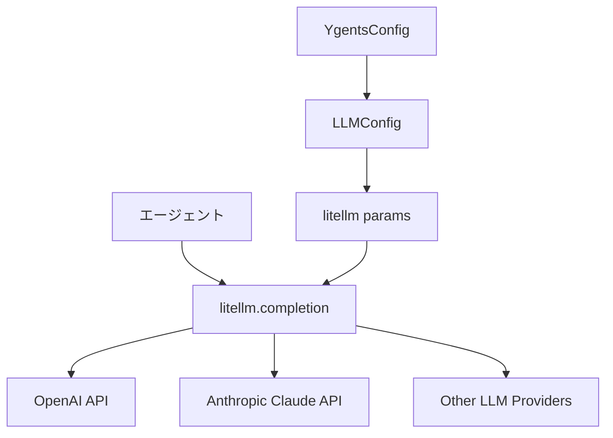

# LLMインターフェース設計ドキュメント（簡素化方針）

## 概要

ygentsプロジェクトのLLMインターフェースは、独自のラッパーモジュールを実装せず、LiteLLMライブラリを直接利用する簡素化された設計を採用します。この方針により、実装の複雑性を大幅に削減し、LiteLLMの豊富な機能とプロバイダーサポートを直接享受します。

## 設計方針の変更

### 従来の設計（実装中止）
- 独自のLLMインターフェースモジュール（`src/ygents/llm/`）
- プロバイダー固有のクラス（OpenAIConfig、ClaudeConfig等）
- レスポンス処理の抽象化レイヤー
- 独自のエラーハンドリングシステム

### 新設計（LiteLLM直接利用）
- `src/ygents/llm/` モジュールは作成しない
- LiteLLMの `completion()` 関数を直接呼び出し
- 設定からプロバイダー情報をLiteLLMに直接渡す
- LiteLLMの例外処理をそのまま利用

## アーキテクチャ

### モジュール構成

```
src/ygents/
├── config/             # 設定管理（LLM設定含む）
├── mcp/               # MCPクライアント
├── agent/             # エージェント中核ロジック（LiteLLM直接利用）
└── cli/               # CLIインターフェース
```

**注意**: `src/ygents/llm/` モジュールは作成しません。

### データフロー



## 実装方針

### 設定管理

既存の設定モジュールを活用してLLMプロバイダー情報を管理：

```python
# src/ygents/config/models.py（既存）
class LLMConfig(BaseModel):
    provider: Literal["openai", "claude"]
    openai: Optional[OpenAIConfig] = None
    claude: Optional[ClaudeConfig] = None
```

### エージェントでの直接利用

```python
# src/ygents/agent/core.py（実装予定）
import litellm
from ..config.models import YgentsConfig

class Agent:
    def __init__(self, config: YgentsConfig):
        self.config = config
    
    async def generate_response(self, messages: List[Dict]) -> str:
        """LiteLLMを直接利用してレスポンス生成"""
        llm_config = self.config.llm
        
        if llm_config.provider == "openai":
            model = f"openai/{llm_config.openai.model}"
            api_key = llm_config.openai.api_key
        elif llm_config.provider == "claude":
            model = f"claude/{llm_config.claude.model}"
            api_key = llm_config.claude.api_key
        
        response = await litellm.acompletion(
            model=model,
            messages=messages,
            api_key=api_key
        )
        
        return response.choices[0].message.content
```

### エラーハンドリング

LiteLLMの例外をそのまま利用：

```python
import litellm
from litellm.exceptions import AuthenticationError, RateLimitError, APIError

try:
    response = await litellm.acompletion(
        model=model,
        messages=messages,
        api_key=api_key
    )
except AuthenticationError as e:
    # API key関連のエラー
    raise e
except RateLimitError as e:
    # レート制限エラー
    raise e
except APIError as e:
    # その他のAPIエラー
    raise e
```

## 利点

### 1. 実装の大幅簡素化

**削減される実装:**
- LLMインターフェースモジュール全体（~200行）
- プロバイダー固有のクライアントクラス
- レスポンス処理の抽象化レイヤー
- 独自のエラーハンドリングシステム
- 対応するテストスイート（~30テストケース）

### 2. LiteLLMの豊富な機能を直接享受

**利用可能な機能:**
- 100+ LLMプロバイダーサポート
- 自動リトライとエラーハンドリング
- レスポンスキャッシュ
- 使用量トラッキング
- ストリーミング対応
- 関数呼び出し（Function Calling）

### 3. 保守性の向上

**メリット:**
- LiteLLMのアップデートを直接享受
- 新しいプロバイダー対応の自動追従
- バグ修正とパフォーマンス改善の自動適用
- ドキュメント・サポートの充実

### 4. 設定の一貫性

既存の設定管理システムを活用して一貫性を保持：

```yaml
# config.yaml
llm:
  provider: "openai"
  openai:
    api_key: "${OPENAI_API_KEY}"
    model: "gpt-4"

# または
llm:
  provider: "claude"
  claude:
    api_key: "${ANTHROPIC_API_KEY}"
    model: "claude-3-sonnet-20240229"
```

## 実装例

### 基本的な利用パターン

```python
# エージェント内でのLiteLLM直接利用
class Agent:
    async def process_request(self, user_input: str) -> str:
        messages = [
            {"role": "system", "content": "You are a helpful assistant."},
            {"role": "user", "content": user_input}
        ]
        
        # LiteLLMを直接呼び出し
        response = await litellm.acompletion(
            model=self._get_model_string(),
            messages=messages,
            api_key=self._get_api_key()
        )
        
        return response.choices[0].message.content
    
    def _get_model_string(self) -> str:
        """設定からモデル文字列を生成"""
        llm_config = self.config.llm
        if llm_config.provider == "openai":
            return f"openai/{llm_config.openai.model}"
        elif llm_config.provider == "claude":
            return f"claude/{llm_config.claude.model}"
    
    def _get_api_key(self) -> str:
        """設定からAPI keyを取得"""
        llm_config = self.config.llm
        if llm_config.provider == "openai":
            return llm_config.openai.api_key
        elif llm_config.provider == "claude":
            return llm_config.claude.api_key
```

### MCP連携での利用

```python
# MCPツール結果をLLMに渡す
class Agent:
    async def execute_with_mcp(self, user_request: str) -> str:
        # 1. ユーザーリクエストを分析
        analysis = await self._analyze_request(user_request)
        
        # 2. 必要なMCPツールを実行
        mcp_results = []
        for tool_call in analysis.tool_calls:
            result = await self.mcp_client.execute_tool(
                tool_call.server, tool_call.tool, tool_call.arguments
            )
            mcp_results.append(result)
        
        # 3. MCP結果を含めてLLMで最終応答生成
        messages = [
            {"role": "system", "content": "You are a helpful assistant with access to tools."},
            {"role": "user", "content": user_request},
            {"role": "assistant", "content": f"Tool results: {mcp_results}"},
            {"role": "user", "content": "Please provide a comprehensive response based on the tool results."}
        ]
        
        response = await litellm.acompletion(
            model=self._get_model_string(),
            messages=messages,
            api_key=self._get_api_key()
        )
        
        return response.choices[0].message.content
```

## テスト戦略

### 削減されるテスト

独自のLLMインターフェースモジュールを実装しないため、以下のテストは不要：

- LLMクライアント単体テスト
- プロバイダー固有のテスト
- レスポンス処理テスト
- エラーハンドリングテスト

### 必要なテスト

エージェントロジック内でのLiteLLM統合テスト：

```python
# tests/test_agent/test_llm_integration.py
@pytest.mark.asyncio
async def test_llm_integration_openai(mock_openai_response):
    """OpenAI統合テスト（LiteLLMモック使用）"""
    
@pytest.mark.asyncio  
async def test_llm_integration_claude(mock_claude_response):
    """Claude統合テスト（LiteLLMモック使用）"""

@pytest.mark.asyncio
async def test_llm_error_handling():
    """LiteLLMエラーハンドリングテスト"""
```

## 今後の拡張

### 1. 設定拡張

LiteLLMの高度な機能を活用する設定オプション：

```yaml
llm:
  provider: "openai"
  openai:
    api_key: "${OPENAI_API_KEY}"
    model: "gpt-4"
    temperature: 0.7
    max_tokens: 2000
    timeout: 30
```

### 2. 高度なLiteLLM機能

将来的に活用可能な機能：

- ストリーミングレスポンス
- 関数呼び出し（Function Calling）
- レスポンスキャッシュ
- 複数プロバイダーの負荷分散

### 3. 監視・ロギング

LiteLLMの統計情報を活用：

```python
import litellm
from litellm import success_callback, failure_callback

# 使用量トラッキング
@success_callback
def log_success(kwargs, response_obj, start_time, end_time):
    print(f"LLM call successful: {response_obj.usage}")

@failure_callback  
def log_failure(kwargs, response_obj, start_time, end_time):
    print(f"LLM call failed: {response_obj}")
```

## 関連ドキュメント

- [LiteLLM Documentation](https://docs.litellm.ai/)
- [設定管理モジュール設計](./config-management.md)
- [エージェント中核ロジック設計](./agent-core.md)（作成予定）
- [実装計画書](../IMPLEMENTATION_PLAN.md)

## まとめ

LiteLLMを直接利用することで：

1. **実装コストの大幅削減**: 独自モジュール不要
2. **機能豊富性**: LiteLLMの全機能を直接享受
3. **保守性の向上**: アップデートの自動追従
4. **設定の統一**: 既存設定システムとの統合

この方針により、より多くのリソースをエージェントの中核ロジックとユーザーエクスペリエンスの向上に集中できます。