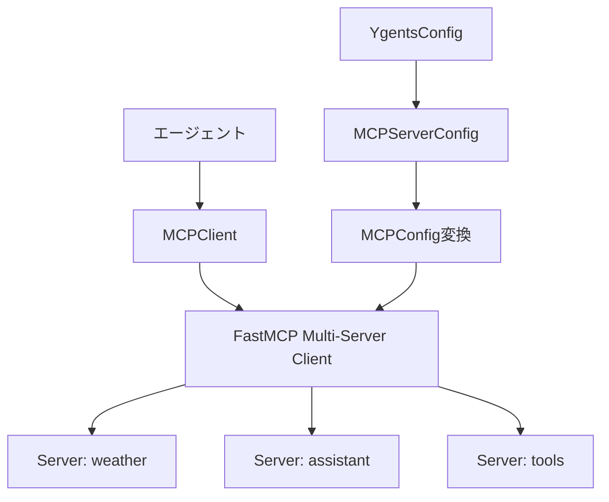
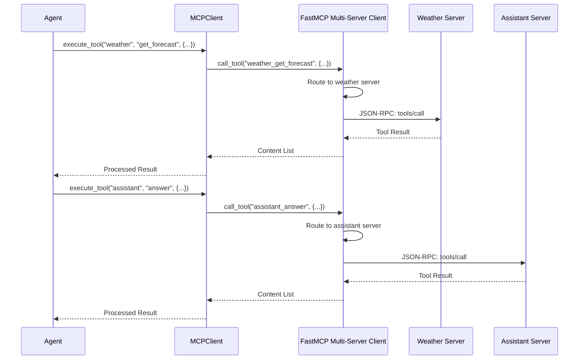

# MCPクライアントモジュール設計ドキュメント

## 概要

ygentsプロジェクトのMCPクライアントモジュールは、Model Context Protocol (MCP) サーバーとの通信を管理し、エージェントがMCPサーバーの機能を利用できるようにします。FastMCPライブラリのMulti-Server Clients機能（v2.4.0+）を活用して、設定ファイルからMCPConfig形式への変換とエージェント向けの統一インターフェースを提供します。

## アーキテクチャ

### モジュール構成

```
src/ygents/mcp/
├── __init__.py         # パブリックAPI
├── client.py           # MCPClient（設定変換とインターフェース）
└── exceptions.py       # MCP専用例外
```

### データフロー



## MCPクライアントアーキテクチャ

### MCPClient

FastMCPのMulti-Server Clients機能をラップして、設定ファイルベースの統合管理を提供します。

```python
class MCPClient:
    """FastMCP Multi-Server Clientのラッパー"""
    
    def __init__(self, servers_config: Dict[str, MCPServerConfig])
    async def execute_tool(self, server_name: str, tool_name: str, arguments: Dict[str, Any]) -> List[Any]
    async def list_tools(self, server_name: str = None) -> Union[List[Tool], Dict[str, List[Tool]]]
    async def list_resources(self, server_name: str = None) -> Union[List[Resource], Dict[str, List[Resource]]]
    async def read_resource(self, uri: str) -> List[Any]
    def is_connected(self) -> bool
    async def close(self) -> None
```

**主要機能:**
- MCPServerConfig → MCPConfig形式の変換
- FastMCPのプレフィックス付きツール名の管理
- エージェント向けの簡潔なインターフェース
- 統一されたエラーハンドリング

### FastMCP Multi-Server Clientsの活用

FastMCPライブラリのMulti-Server Clients機能が自動的に処理：

**自動管理機能:**
- 複数サーバーの接続管理
- ツール名の自動プレフィックス（`servername_toolname`）
- リソースURIの自動プレフィックス（`protocol://servername/resource/path`）
- 各サーバーへの自動ルーティング

**使用例:**
```python
# FastMCP Multi-Server Client の機能
config = {
    "mcpServers": {
        "weather": {"url": "https://weather-api.example.com/mcp"},
        "assistant": {"command": "python", "args": ["./assistant_server.py"]}
    }
}

client = Client(config)
async with client:
    # 自動的にweather_get_forecastにルーティング
    weather_data = await client.call_tool("weather_get_forecast", {"city": "Tokyo"})
    # 自動的にassistant_answer_questionにルーティング  
    response = await client.call_tool("assistant_answer_question", {"question": "Hello"})
```

### エラーハンドリング

FastMCPの例外をygents向けにラップします。

```python
class MCPException(Exception):
    """MCP 基底例外"""
    pass

class MCPConnectionError(MCPException):
    """接続エラー（fastmcp.ConnectionError をラップ）"""
    pass

class MCPToolError(MCPException):
    """ツール実行エラー（fastmcp.ClientError をラップ）"""
    pass

class MCPTimeoutError(MCPException):
    """タイムアウトエラー"""
    pass
```

## 設定とライフサイクル

### サーバー設定変換

既存の`MCPServerConfig`をFastMCPのMCPConfig形式に変換：

```python
def convert_to_mcp_config(servers_config: Dict[str, MCPServerConfig]) -> dict:
    """MCPServerConfig → FastMCP MCPConfig形式に変換"""
    mcp_servers = {}
    
    for server_name, config in servers_config.items():
        if config.url:
            mcp_servers[server_name] = {"url": config.url}
        elif config.command:
            mcp_servers[server_name] = {
                "command": config.command,
                "args": config.args
            }
    
    return {"mcpServers": mcp_servers}

# 設定例
servers_config = {
    "weather": MCPServerConfig(url="https://weather-api.example.com/mcp"),
    "assistant": MCPServerConfig(command="python", args=["./assistant_server.py"])
}

# 変換後のMCPConfig
mcp_config = convert_to_mcp_config(servers_config)
# {
#   "mcpServers": {
#     "weather": {"url": "https://weather-api.example.com/mcp"},
#     "assistant": {"command": "python", "args": ["./assistant_server.py"]}
#   }
# }
```

### ライフサイクル管理

```python
# 初期化とFastMCP Multi-Server Clientの作成
client = MCPClient(servers_config)

# Context Managerによる接続管理
async with client:
    # FastMCPが自動的に全サーバーに接続
    
    # プレフィックス付きツール実行
    result = await client.execute_tool("weather", "get_forecast", {"city": "Tokyo"})
    # 内部的に "weather_get_forecast" として FastMCP に渡される
    
    # 全ツール一覧取得
    all_tools = await client.list_tools()
    # {"weather": [...], "assistant": [...]}
    
# with文を抜ける時に自動的に全接続が閉じられる
```

## ツール実行フロー

### Multi-Server Client による統合実行フロー



### FastMCP Multi-Server Clientによる自動処理

FastMCPライブラリが自動的に処理する機能：
- 複数サーバーへの接続確立と維持
- ツール名プレフィックスによる自動ルーティング
- プロトコルレベルのエラーハンドリング
- タイムアウト管理と再接続ロジック
- サーバー間での統一されたインターフェース

## テスト設計

### テスト構成

```
tests/test_mcp/
├── __init__.py
├── conftest.py            # MCPテスト用Fixture
├── test_client.py         # MCPClientテスト（12テストケース）
└── test_exceptions.py     # 例外処理テスト（3テストケース）
```

### テスト範囲

**合計15テストケース、95%カバレッジ目標**

FastMCP Multi-Server Clientが大部分の機能を提供するため、テストは設定変換とインターフェースに集中：

#### MCPClientテスト (test_client.py)
- MCPServerConfig → MCPConfig変換の正確性
- プレフィックス付きツール実行（server_name + tool_name → prefixed_tool_name）
- ツール一覧取得（個別サーバー・全サーバー）
- リソース操作とURI処理
- Context Managerの動作
- 接続状態管理

#### 例外処理テスト (test_exceptions.py)
- FastMCP例外のラッピング
- カスタム例外の発生
- エラーメッセージの適切性

### テストFixture

FastMCPのin-memoryサーバーとMulti-Server Clientを活用：

```python
@pytest.fixture
def mock_fastmcp_servers():
    """複数のFastMCPサーバーを作成"""
    from fastmcp import FastMCP
    
    weather_server = FastMCP(name="WeatherServer")
    assistant_server = FastMCP(name="AssistantServer")
    
    @weather_server.tool()
    def get_forecast(city: str) -> str:
        return f"Weather in {city}: Sunny"
    
    @assistant_server.tool()
    def answer_question(question: str) -> str:
        return f"Answer: {question}"
    
    return {
        "weather": weather_server,
        "assistant": assistant_server
    }

@pytest.fixture
def mcp_server_configs():
    """テスト用サーバー設定"""
    return {
        "weather": MCPServerConfig(url="https://test-weather.com/mcp"),
        "assistant": MCPServerConfig(command="python", args=["assistant.py"])
    }

@pytest.fixture
async def mcp_client(mock_fastmcp_servers):
    """テスト用MCPClient（FastMCPのin-memoryサーバー使用）"""
    # Multi-Server Client でテスト
    config = {
        "mcpServers": {
            "weather": mock_fastmcp_servers["weather"],
            "assistant": mock_fastmcp_servers["assistant"]
        }
    }
    
    client = MCPClient.from_fastmcp_config(config)
    async with client:
        yield client
```

## 実装の特徴

### FastMCP Multi-Server Clientsへの依存による極度の簡素化

**FastMCP Multi-Server Clientsが提供する機能:**
- 複数サーバーの統合接続管理
- 自動プレフィックス付与とルーティング
- JSON-RPC 2.0プロトコル実装
- 非同期通信とContext Manager
- タイムアウトとエラーハンドリング
- 各トランスポートの自動推論

**独自実装が必要な機能（最小限）:**
- MCPServerConfig → MCPConfig形式変換
- エージェント向けインターフェース（server_name + tool_name の分離）
- ygents固有のエラーラッピング

### 設計の簡潔性

**従来の設計 vs Multi-Server Client活用後:**
- **モジュール数**: 5ファイル → 2ファイル
- **クラス数**: 複数クラス → 1つのラッパークラス
- **テストケース**: 40テストケース → 15テストケース
- **実装コード**: 数百行 → 数十行

### 保守性

- **極薄ラッパー**: FastMCPの機能をほぼそのまま利用
- **設定変換のみ**: MCPServerConfig ⇔ MCPConfig変換が主な責務
- **FastMCP依存**: ライブラリの進化を直接享受

## FastMCP Multi-Server Clientsの活用方針

### 実装パターン

```python
class MCPClient:
    def __init__(self, servers_config: Dict[str, MCPServerConfig]):
        # MCPConfig形式に変換
        mcp_config = self._convert_to_mcp_config(servers_config)
        # FastMCPのMulti-Server Clientを直接使用
        self._fastmcp_client = Client(mcp_config)
    
    async def execute_tool(self, server_name: str, tool_name: str, arguments: Dict[str, Any]):
        # プレフィックス付きツール名を作成
        prefixed_tool_name = f"{server_name}_{tool_name}"
        # FastMCPに委譲
        return await self._fastmcp_client.call_tool(prefixed_tool_name, arguments)
```

### Multi-Server Clientsの自動機能

1. **設定からの自動サーバー起動**
   ```python
   config = {"mcpServers": {"weather": {"url": "..."}, "assistant": {"command": "..."}}}
   async with Client(config) as client:
       # 両サーバーが自動的に接続される
   ```

2. **自動プレフィックスとルーティング**
   ```python
   # weather_get_forecast → weatherサーバーのget_forecastツールに自動ルーティング
   await client.call_tool("weather_get_forecast", {"city": "Tokyo"})
   ```

3. **統一されたリソースアクセス**
   ```python
   # weather://weather/icons/sunny → weatherサーバーのリソースに自動ルーティング
   await client.read_resource("weather://weather/icons/sunny")
   ```

### 今後の拡張予定

1. **FastMCPライブラリの新機能活用**
   - Multi-Server Clientsの機能拡張追従
   - 新しいトランスポートタイプ対応
   - パフォーマンス最適化の自動適用

2. **エージェント統合機能**
   - ツール検索・発見機能
   - 実行結果のフォーマット統一
   - エラーリカバリとフォールバック

3. **設定管理強化**
   - 動的サーバー追加・削除
   - 設定ホットリロード
   - サーバーヘルスモニタリング

## 関連ファイル

- `src/ygents/mcp/client.py`: MCPClient実装（薄いラッパー）
- `src/ygents/mcp/exceptions.py`: 例外定義
- `src/ygents/config/models.py`: MCPServerConfig定義
- `tests/test_mcp/`: MCPテストスイート
- `pyproject.toml`: fastmcp依存関係定義
- `design/libs/factmcp/clients.mdx`: FastMCPクライアントドキュメント