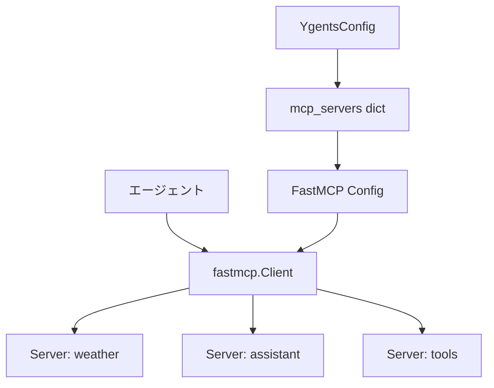
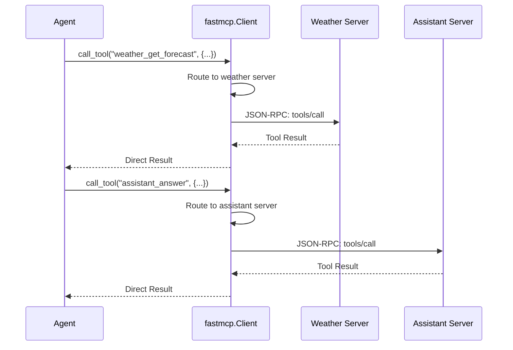

# MCP統合設計ドキュメント（簡素化方針）

## 概要

ygentsプロジェクトのMCP統合は、独自のMCPクライアントモジュールを実装せず、FastMCPライブラリを直接利用する簡素化された設計を採用します。エージェント内でFastMCPのMulti-Server Clients機能を直接使用し、実装の複雑性を大幅に削減します。

## 設計方針の変更

### 従来の設計（実装中止）
- 独自のMCPクライアントモジュール（`src/ygents/mcp/`）
- MCPClient ラッパークラス
- 独自の例外ハンドリングシステム
- エージェント向けの抽象化レイヤー

### 新設計（FastMCP直接利用）
- `src/ygents/mcp/` モジュールは作成しない
- FastMCPの `Client` クラスを直接利用
- 設定からFastMCPConfigを直接生成
- FastMCPの例外処理をそのまま利用

## アーキテクチャ

### モジュール構成

```
src/ygents/
├── config/             # 設定管理（MCP設定含む）
├── agent/              # エージェント中核ロジック（FastMCP直接利用）
└── cli/                # CLIインターフェース
```

**注意**: `src/ygents/mcp/` モジュールは作成しません。

### データフロー



## 実装方針

### FastMCP直接利用

エージェント内でFastMCPのClientクラスを直接使用します：

```python
# src/ygents/agent/core.py（実装予定）
import fastmcp
from ..config.models import YgentsConfig

class Agent:
    def __init__(self, config: YgentsConfig):
        self.config = config
        self._mcp_client = None
    
    async def _get_mcp_client(self) -> fastmcp.Client:
        """FastMCPクライアントを取得"""
        if self._mcp_client is None:
            mcp_config = {"mcpServers": self.config.mcp_servers}
            self._mcp_client = fastmcp.Client(mcp_config)
        return self._mcp_client
    
    async def execute_mcp_tool(self, server_name: str, tool_name: str, arguments: dict):
        """MCPツールを実行"""
        client = await self._get_mcp_client()
        async with client:
            # FastMCPが自動的にプレフィックス付きツール名にルーティング
            prefixed_tool_name = f"{server_name}_{tool_name}"
            return await client.call_tool(prefixed_tool_name, arguments)
```

**簡素化のメリット:**
- 独自のMCPClientラッパークラスが不要
- FastMCPの全機能を直接享受
- 設定変換レイヤーの削除
- テストケースの大幅削減

### FastMCP Multi-Server Clientsの活用

FastMCPライブラリのMulti-Server Clients機能をそのまま活用：

**自動管理機能:**
- 複数サーバーの接続管理
- ツール名の自動プレフィックス（`servername_toolname`）
- リソースURIの自動プレフィックス（`protocol://servername/resource/path`）
- 各サーバーへの自動ルーティング

**使用例:**
```python
# エージェント内でのFastMCP直接利用
config = {
    "mcpServers": {
        "weather": {"url": "https://weather-api.example.com/mcp"},
        "assistant": {"command": "python", "args": ["./assistant_server.py"]}
    }
}

client = fastmcp.Client(config)
async with client:
    # 自動的にweather_get_forecastにルーティング
    weather_data = await client.call_tool("weather_get_forecast", {"city": "Tokyo"})
    # 自動的にassistant_answer_questionにルーティング  
    response = await client.call_tool("assistant_answer_question", {"question": "Hello"})
```

### エラーハンドリング

FastMCPの例外をそのまま利用：

```python
import fastmcp
from fastmcp.exceptions import ClientError, ConnectionError

try:
    result = await client.call_tool("weather_get_forecast", {"city": "Tokyo"})
except ConnectionError as e:
    # MCP接続エラー
    raise e
except ClientError as e:
    # ツール実行エラー
    raise e
except Exception as e:
    # その他のエラー
    raise e
```

## 設定とライフサイクル

### サーバー設定（FastMCP直接利用）

設定管理モジュールからMCP設定を取得し、FastMCPに直接渡します：

```python
# src/ygents/agent/core.py（実装予定）
class Agent:
    def _create_fastmcp_config(self) -> dict:
        """YgentsConfigからFastMCPConfig形式を生成"""
        return {"mcpServers": self.config.mcp_servers}

# 設定例（config.yaml）
mcp_servers:
  weather:
    url: "https://weather-api.example.com/mcp"
  assistant:
    command: "python"
    args: ["./assistant_server.py"]
  advanced:
    command: "node"
    args: ["server.js"]
    env:
      DEBUG: "true"

# エージェント内での利用
agent = Agent(config)
fastmcp_config = agent._create_fastmcp_config()
# {
#   "mcpServers": {
#     "weather": {"url": "https://weather-api.example.com/mcp"},
#     "assistant": {"command": "python", "args": ["./assistant_server.py"]},
#     "advanced": {"command": "node", "args": ["server.js"], "env": {"DEBUG": "true"}}
#   }
# }
```

**簡素化のメリット:**
- 独自のMCPClientクラスが不要
- 設定変換が単純な辞書ラップのみ
- FastMCPの全機能を直接享受
- バリデーションはFastMCPに完全委譲

### ライフサイクル管理（エージェントと同期）

AgentのライフサイクルとMCPクライアントのライフサイクルを一致させます：

```python
# エージェント内でのFastMCP永続接続管理
class Agent:
    def __init__(self, config: YgentsConfig):
        self.config = config
        self._mcp_client = None
        self._mcp_client_connected = False
    
    async def __aenter__(self) -> "Agent":
        """エージェント開始時にMCPクライアントも初期化"""
        fastmcp_config = self._create_fastmcp_config()
        self._mcp_client = fastmcp.Client(fastmcp_config)
        await self._mcp_client.__aenter__()
        self._mcp_client_connected = True
        return self
    
    async def __aexit__(self, exc_type, exc_val, exc_tb):
        """エージェント終了時にMCPクライアントも終了"""
        if self._mcp_client and self._mcp_client_connected:
            await self._mcp_client.__aexit__(exc_type, exc_val, exc_tb)
            self._mcp_client_connected = False
    
    async def process_request(self, user_input: str):
        """リクエスト処理（既存の接続を再利用）"""
        if not self._mcp_client_connected:
            raise RuntimeError("Agent not connected. Use 'async with agent:' pattern.")
        
        # 既存の接続を使ってツール実行
        result = await self._mcp_client.call_tool("weather_get_forecast", {"city": "Tokyo"})
        
        # ツール一覧取得
        tools = await self._mcp_client.list_tools()
        
        # リソース読み込み
        resource = await self._mcp_client.read_resource("weather://data/forecast")
        
        return result

# 使用例
async def main():
    config = load_config("config.yaml")
    async with Agent(config) as agent:
        # エージェント開始時に全MCPサーバーに接続
        
        # 複数リクエストで同じ接続を再利用
        result1 = await agent.process_request("東京の天気は？")
        result2 = await agent.process_request("大阪の天気は？")
        result3 = await agent.process_request("明日の予報は？")
        
    # エージェント終了時に全接続が閉じられる
```

## ツール実行フロー（簡素化）

### FastMCP直接利用による実行フロー



### FastMCP Multi-Server Clientによる自動処理

FastMCPライブラリが自動的に処理する機能（独自実装不要）：
- 複数サーバーへの接続確立と維持
- ツール名プレフィックスによる自動ルーティング
- プロトコルレベルのエラーハンドリング
- タイムアウト管理と再接続ロジック
- サーバー間での統一されたインターフェース

## テスト戦略（削減）

### 削減されるテスト

独自のMCPクライアントモジュールを実装しないため、以下のテストは不要：

- MCPClientクラスの単体テスト
- 独自例外ハンドリングテスト
- 設定変換テスト
- ツール実行ラッパーテスト
- 接続管理テスト

### 必要なテスト

エージェントロジック内でのFastMCP統合テスト：

```python
# tests/test_agent/test_mcp_integration.py
@pytest.mark.asyncio
async def test_fastmcp_integration(mock_mcp_servers):
    """FastMCP統合テスト（in-memoryサーバー使用）"""
    
@pytest.mark.asyncio  
async def test_mcp_tool_execution(mock_config):
    """MCPツール実行テスト（FastMCPモック使用）"""

@pytest.mark.asyncio
async def test_mcp_error_handling():
    """FastMCPエラーハンドリングテスト"""
```

### テストFixture（簡素化）

エージェントテスト内でFastMCPのin-memoryサーバーを直接活用：

```python
# tests/test_agent/conftest.py
@pytest.fixture
def mock_fastmcp_servers():
    """FastMCPのin-memoryサーバーを作成"""
    from fastmcp import FastMCP
    
    weather_server = FastMCP(name="WeatherServer")
    assistant_server = FastMCP(name="AssistantServer")
    
    @weather_server.tool()
    def get_forecast(city: str) -> str:
        return f"Weather in {city}: Sunny"
    
    @assistant_server.tool()
    def answer_question(question: str) -> str:
        return f"Answer: {question}"
    
    return {
        "weather": weather_server,
        "assistant": assistant_server
    }

@pytest.fixture
def mock_agent_config(mock_fastmcp_servers):
    """テスト用エージェント設定"""
    from ygents.config.models import YgentsConfig, LLMConfig, OpenAIConfig
    
    return YgentsConfig(
        mcp_servers={
            "weather": mock_fastmcp_servers["weather"],
            "assistant": mock_fastmcp_servers["assistant"]
        },
        llm=LLMConfig(
            provider="openai",
            openai=OpenAIConfig(api_key="test-key")
        )
    )
```

## 利点

### 1. 実装の大幅簡素化

**削減される実装:**
- 独自MCPクライアントモジュール全体（~70行）
- MCPClient ラッパークラス
- 独自例外ハンドリングシステム
- 設定変換レイヤー
- 対応するテストスイート（~10テストケース）

### 2. パフォーマンスの向上

**永続接続による効率化:**
- リクエストごとの接続確立コストを削減
- MCPサーバーとの接続状態を維持
- 複数リクエストでの接続再利用
- インタラクティブモードでの高速応答

### 3. FastMCPの豊富な機能を直接享受

**利用可能な機能:**
- 複数サーバーの統合接続管理
- 自動プレフィックス付与とルーティング
- JSON-RPC 2.0プロトコル完全実装
- 非同期通信とContext Manager
- タイムアウトとエラーハンドリング
- 各トランスポート（HTTP、WebSocket、stdin/stdout）の自動推論

### 4. 保守性の向上

**メリット:**
- FastMCPのアップデートを直接享受
- 新しいMCPプロトコル機能の自動追従
- バグ修正とパフォーマンス改善の自動適用
- ドキュメント・サポートの充実

### 5. 設定の一貫性

既存の設定管理システムを活用して一貫性を保持：

```yaml
# config.yaml
mcp_servers:
  weather:
    url: "https://weather-api.example.com/mcp"
  assistant:
    command: "python"
    args: ["./assistant_server.py"]
```

## 実装例

### エージェント内でのFastMCP永続接続

```python
# src/ygents/agent/core.py（実装予定）
import fastmcp
from fastmcp.exceptions import ClientError, ConnectionError
from ..config.models import YgentsConfig

class Agent:
    def __init__(self, config: YgentsConfig):
        self.config = config
        self._mcp_client = None
        self._mcp_client_connected = False
    
    def _create_fastmcp_config(self) -> dict:
        """設定からFastMCPConfig形式を生成"""
        return {"mcpServers": self.config.mcp_servers}
    
    async def __aenter__(self) -> "Agent":
        """エージェント開始時にMCPクライアントを初期化・接続"""
        fastmcp_config = self._create_fastmcp_config()
        self._mcp_client = fastmcp.Client(fastmcp_config)
        await self._mcp_client.__aenter__()
        self._mcp_client_connected = True
        return self
    
    async def __aexit__(self, exc_type, exc_val, exc_tb):
        """エージェント終了時にMCPクライアントを切断"""
        if self._mcp_client and self._mcp_client_connected:
            await self._mcp_client.__aexit__(exc_type, exc_val, exc_tb)
            self._mcp_client_connected = False
    
    async def execute_mcp_tool(self, server_name: str, tool_name: str, arguments: dict):
        """MCPツールを実行（永続接続を使用）"""
        if not self._mcp_client_connected:
            raise RuntimeError("Agent not connected. Use 'async with agent:' pattern.")
        
        try:
            # 永続接続を使ってツール実行
            prefixed_tool_name = f"{server_name}_{tool_name}"
            return await self._mcp_client.call_tool(prefixed_tool_name, arguments)
        except ConnectionError as e:
            raise e  # 接続エラーをそのまま伝播
        except ClientError as e:
            raise e  # ツール実行エラーをそのまま伝播
    
    async def list_mcp_tools(self) -> list:
        """利用可能なMCPツール一覧を取得"""
        if not self._mcp_client_connected:
            raise RuntimeError("Agent not connected. Use 'async with agent:' pattern.")
        
        return await self._mcp_client.list_tools()
```

### LiteLLM + FastMCP統合例（永続接続）

```python
# エージェント内でのLiteLLM + FastMCP連携（永続接続使用）
class Agent:
    async def process_request(self, user_input: str) -> str:
        """リクエスト処理（永続MCP接続を再利用）"""
        if not self._mcp_client_connected:
            raise RuntimeError("Agent not connected. Use 'async with agent:' pattern.")
        
        # 1. ユーザーリクエストをLLMで分析
        analysis = await self._analyze_request_with_llm(user_input)
        
        # 2. 必要なMCPツールを実行（永続接続を再利用）
        mcp_results = []
        for tool_call in analysis.tool_calls:
            result = await self.execute_mcp_tool(
                tool_call.server, tool_call.tool, tool_call.arguments
            )
            mcp_results.append(result)
        
        # 3. MCP結果を含めてLLMで最終応答生成
        return await self._generate_response_with_llm(user_input, mcp_results)

# 使用例：複数リクエストでの永続接続活用
async def main():
    config = load_config("config.yaml")
    
    async with Agent(config) as agent:
        # エージェント開始時に一度だけMCPサーバーに接続
        
        # 複数リクエストで同じ接続を効率的に再利用
        result1 = await agent.process_request("東京の天気を教えて")
        result2 = await agent.process_request("大阪の気温は？") 
        result3 = await agent.process_request("明日の予報をお願いします")
        
        # CLI/インタラクティブモードでも永続接続を維持
        while True:
            user_input = input("質問: ")
            if user_input.lower() in ['quit', 'exit']:
                break
            response = await agent.process_request(user_input)
            print(f"回答: {response}")
    
    # エージェント終了時に全MCP接続が自動的に閉じられる
```

## 今後の拡張

### 1. FastMCPライブラリの新機能活用
- Multi-Server Clientsの機能拡張追従
- 新しいトランスポートタイプ対応
- パフォーマンス最適化の自動適用

### 2. エージェント統合機能
- 動的ツール検索・発見
- 実行結果の構造化処理
- エラーリカバリとフォールバック

### 3. 設定管理の高度化
- 動的サーバー追加・削除
- 設定ホットリロード
- サーバーヘルスモニタリング

## 関連ドキュメント

- [FastMCP Documentation](https://docs.fastmcp.ai/)
- [設定管理モジュール設計](./config-management.md)
- [LLMインターフェース設計](./llm-interface.md)
- [エージェント中核ロジック設計](./agent-core.md)（作成予定）
- [実装計画書](../IMPLEMENTATION_PLAN.md)

## まとめ

FastMCPを直接利用することで：

1. **実装コストの大幅削減**: 独自MCPクライアントモジュール不要
2. **機能豊富性**: FastMCPの全機能を直接享受
3. **保守性の向上**: アップデートの自動追従
4. **設定の統一**: 既存設定システムとの統合

この方針により、より多くのリソースをエージェントの中核ロジックとユーザーエクスペリエンスの向上に集中できます。